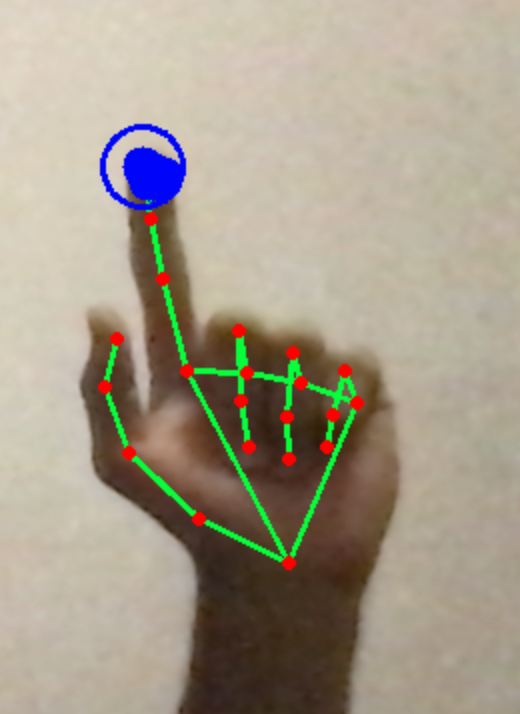
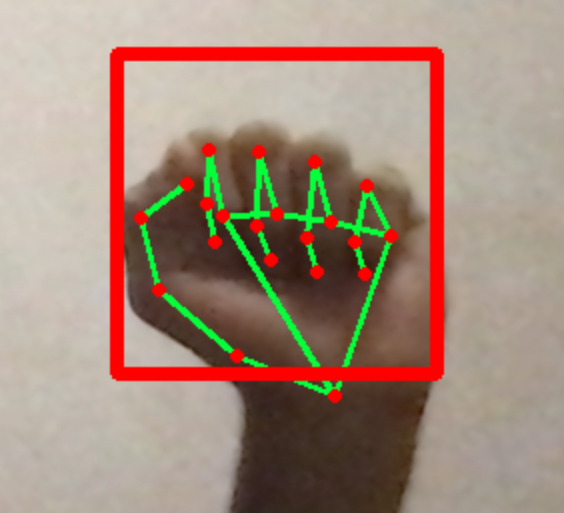

<h1 align="center"> Virtual drawing board ✍️</h1>

<h2 align="center">

</h2>

### Drawing on a virtual canvas using hand pose estimation

 
<h3 align="center">

</h3>
 

## Libraries used
- PyTorch 
- Mediapipe 
- OpenCV

To test the whiteboard, run `main.py`.

- Clenching a fist with your index finger sticking out allows you to **draw**.

- Closing your hand into a fist allows you to **erase**, where the red box represents the bounds of the eraser.

- Holding your hand with all of your fingers open does nothing.

## References

- [Mediapipe repository](https://github.com/google/mediapipe.git)
- [Hand pose estimation tutorial](https://www.youtube.com/watch?v=NZde8Xt78Iw&t=983s)

<h3 align="right">

Licensed under the [MIT License](LICENSE)

</h3>
